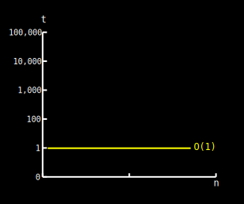
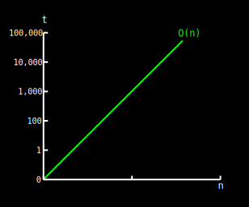
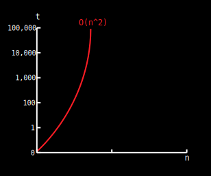
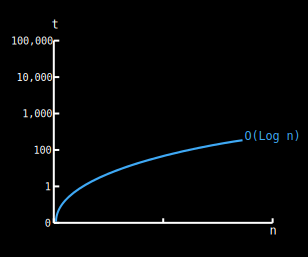
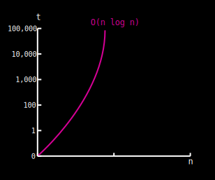
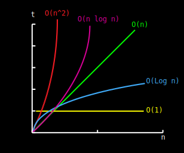

 {#main}
HOW TO DETERMINE COMPLEXITIES {#how-to-determine-complexities .titles}
=============================

We can determine complexity based on the type of statements used by a
program. The following examples are in java but can be easily followed
if you have basic programming experience and use big O notation we will
explain later why big O notation is commonly used:

Constant time: O(1) {#constant-time-o1 .inner-titles}
-------------------

The following operations take *constant time*:

-   Assigning a value to some variable
-   Inserting an element in an array
-   Determining if a binary number is even or odd.
-   Retrieving element i from an array
-   Retrieving a value from a hash table(dictionary) with a key

They take constant time because they are \"simple\" statements. In this
case we say the statement time is O(1)

 {.code-div}
                        
        int example = 1;
                    

As you can see in the graph below constant time is indifferent of input
size. Declaring a variable, inserting an element in a stack, inserting
an element into an unsorted linked list all these statements take
constant time.

{.graphs}

Linear time: O(n) {#linear-time-on .inner-titles}
-----------------

The next loop executes N times, if we assume the statement inside the
loop is O(1), then the total time for the loop is N\*O(1), which equals
O(N) also known as *linear time*:

 {.code-div}
                        
        for (int i = 0; i < N; i++) {
                //do something in constant time...
        }
                    
                    

In the following graph we can see how running time increases linearly in
relation to the number of elements n:

{.graphs}

More examples of linear time are:

-   Finding an item in an unsorted collection or a unbalanced tree
    (worst case)
-   Sorting an array via bubble sort

Quadratic time: O(n^2^) {#quadratic-time-on2 .inner-titles}
-----------------------

In this example the first loop executes N times. For each time the outer
loop executes, the inner loop executes N times. Therefore, the statement
in the nested loop executes a total of N \* N times. Here the complexity
is O(N\*N) which equals O(N^2^). This should be avoided as this
complexity grows in *quadratic time*

 {.code-div}
                        
        for (int i=0; i < N; i++) {
                    for(int j=0; j< N; j++){
                           //do something in constant time...
                    }
        }
                    
                    

Some extra examples of quadratic time are:

-   Performing linear search in a matrix
-   Time complexity of quicksort, which is highly improbable as we will
    see in the [Algorithms](algorithms.html) section of this website.
-   Insertion sort

Algorithms that scale in quadratic time are better to be avoided. Once
the input size reaches n=100,000 element it can take 10 seconds to
complete. For an input size of n=1'000,000 it can take \~16 min to
complete; and for an input size of n=10'000,000 it could take \~1.1 days
to complete\...you get the idea.

{.graphs}

Logarithmic time: O(Log n) {#logarithmic-time-olog-n .inner-titles}
--------------------------

Logarithmic time grows slower as N grows. An easy way to check if a loop
is log n is to see if the counting variable (in this case: i) doubles
instead of incrementing by 1. In the following example `int i` doesn't
increase by 1 (i++), it doubles with each run thus traversing the loop
in log(n) time:

 {.code-div}
                        
        for(int i=0; i < n; i *= 2) {
                //do something in constant time...
            }                       
        
                    

Some common examples of logarithmic time are:

-   Binary search
-   Insert or delete an element into a heap

Don\'t feel intimidated by logarithms. Just remember that logarithms are
the inverse operation of exponentiating something. Logarithms appear
when things are constantly halved or doubled.

Logarithmic algorithms have excellent performance in large data sets:

{.graphs}

Linearithmic time: O(n\*Log n) {#linearithmic-time-onlog-n .inner-titles}
------------------------------

Linearithmic algorithms are capable of good performance with very large
data sets. Some examples of linearithmic algorithms are:

-   heapsort
-   merge sort
-   Quick sort

We\'ll see a custom implementation of Merge and Quicksort in the
[algorithms](algorithms.html) section. But for now the following example
helps us illustrate our point:

 {.code-div}
                        
        for(int i= 0; i< n; i++) { // linear loop  O(n) * ...
                    for(int j= 1; j< n; j *= 2){ // ...log (n)
                          //do something in constant time...
                    }
        }                   
                        
                    

{.graphs}

Conclusion {#conclusion .inner-titles}
----------

As you might have noticed, Big O notation describes the worst case
possible. When you loop through an array in order to find if it contains
*X* item the worst case is that it's at the end or that it's not even
present on the list. Making you iterate through all n items, thus O(n).
The best case would be for the item we search to be at the beginning so
every time we loop it takes constant time to search but this is highly
uncommon and becomes more improbable as the list of items increases. In
the next section we\'ll look deeper into why big O focuses on worst case
analysis.

A comparison of the first four complexities, might let you understand
why for large data sets we should avoid quadratic time and strive
towards logarithmic or linearithmic time:

{.graphs}

 {.division}

BIG O NOTATION AND WORST CASE ANALYSIS {#big-o-notation-and-worst-case-analysis .titles}
======================================

Big O notation is simply a measure of how well an algorithm scales (or
its rate of growth). This way we can describe the performance or
complexity of an algorithm. Big O notation focuses on the worst-case
scenario.

Why focus on worst case performance? At first look it might seem
counter-intuitive why not focus on best case or at least in average case
performance? I like a lot the answer given in *The Algorithms Design
Manual* by S. Skiena:

Imagine you go to a casino what will happen if you bring n dollars?

-   The **best case**, is that you walk out owning the casino, it's
    possible but so improbable that you don't even think about it.

-   The **average case**, is a little more tricky to prove as you need
    *domain knowledge* in order to identify which is the average case.
    For example, the average case in our example is that the typical
    bettor loses \~87% of the money that they bring to the casino, but
    people who are drunk surely loose even more, what about experienced
    professional players and what exactly is the average? How did they
    determined it? Who determined the average case? Are their metrics
    correct? Average case just makes the task of analyzing an algorithm
    even more complex.

-   The **worst case** is that you lose all your n dollars, this is easy
    to calculate and very likely to happen.

Now think of this in a context of a program with .search() method which
takes linear time to execute:

The worst case is O(n), this is when the key is at the end or never
present in the list. Which might happen.

The best case is O(1), this happens if and only if the key is at the
beginning of the list. Which becomes even more unlikely as n grows.

 {.division}

