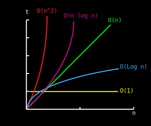

**About:** I made this website as a fun project to help me understand
better: **algorithms**, **data structures** and **big O notation**. And
also to have some practice in: **Java**, **JavaScript**, **CSS**,
**HTML** and **Responsive Web Design (RWD)**. If you discover errors in
the code or typos I haven\'t noticed [please let me
know](https://github.com/cooervo) or feel free to contribute by clicking
this [Github link
{#top-github}](https://github.com/cooervo/algortihms-datastructures)
, fork the project and make a pull request :)

 {#main}
Instructions {#instructions .titles}
============

-   Press the  button to sort the column
    in ascending or descending order
-   Hover over any row to focus on it

Sorting Algorithms

Sorting Algorithms

Space complexity

Time complexity

Worst case

Best case

Average case

Worst case

Insertion Sort

O(1)

O(n)

O(n^2^)

O(n^2^)

Selection Sort

O(1)

O(n^2^)

O(n^2^)

O(n^2^)

Smooth Sort

O(1)

O(n)

O(n log n)

O(n log n)

Bubble Sort

O(1)

O(n)

O(n^2^)

O(n^2^)

Shell Sort

O(1)

O(n)

O(n log n^2^)

O(n log n^2^)

Mergesort

O(n)

O(n log n)

O(n log n)

O(n log n)

Quicksort

O(log n)

O(n log n)

O(n log n)

O(n^2^)

Heapsort

O(1)

O(n log n)

O(n log n)

O(n log n)

Data Structures Comparison

Data Structures

Average Case

Worst Case

Search

Insert

Delete

Search

Insert

Delete

Array

O(n)

N/A

N/A

O(n)

N/A

N/A

Sorted Array

O(log n)

O(n)

O(n)

O(log n)

O(n)

O(n)

Linked List

O(n)

O(1)

O(1)

O(n)

O(1)

O(1)

Doubly Linked List

O(n)

O(1)

O(1)

O(n)

O(1)

O(1)

Stack

O(n)

O(1)

O(1)

O(n)

O(1)

O(1)

Hash table

O(1)

O(1)

O(1)

O(n)

O(n)

O(n)

Binary Search Tree

O(log n)

O(log n)

O(log n)

O(n)

O(n)

O(n)

B-Tree

O(log n)

O(log n)

O(log n)

O(log n)

O(log n)

O(log n)

Red-Black tree

O(log n)

O(log n)

O(log n)

O(log n)

O(log n)

O(log n)

AVL Tree

O(log n)

O(log n)

O(log n)

O(log n)

O(log n)

O(log n)

  n f(n)           log n     n         n log n    n^2^         2^n^          n!
  ---------------- --------- --------- ---------- ------------ ------------- ---------------
  10               0.003ns   0.01ns    0.033ns    0.1ns        1ns           3.65ms
  20               0.004ns   0.02ns    0.086ns    0.4ns        1ms           77years
  30               0.005ns   0.03ns    0.147ns    0.9ns        1sec          8.4x10^15^yrs
  40               0.005ns   0.04ns    0.213ns    1.6ns        18.3min       \--
  50               0.006ns   0.05ns    0.282ns    2.5ns        13days        \--
  100              0.07      0.1ns     0.644ns    0.10ns       4x10^13^yrs   \--
  1,000            0.010ns   1.00ns    9.966ns    1ms          \--           \--
  10,000           0.013ns   10ns      130ns      100ms        \--           \--
  100,000          0.017ns   0.10ms    1.67ms     10sec        \--           \--
  1\'000,000       0.020ns   1ms       19.93ms    16.7min      \--           \--
  10\'000,000      0.023ns   0.01sec   0.23ms     1.16days     \--           \--
  100\'000,000     0.027ns   0.10sec   2.66sec    115.7days    \--           \--
  1,000\'000,000   0.030ns   1sec      29.90sec   31.7 years   \--           \--

  : Growth Rates

Comparison graph {#comparison-graph .titles}
================

{.graphs}

 {.division}

