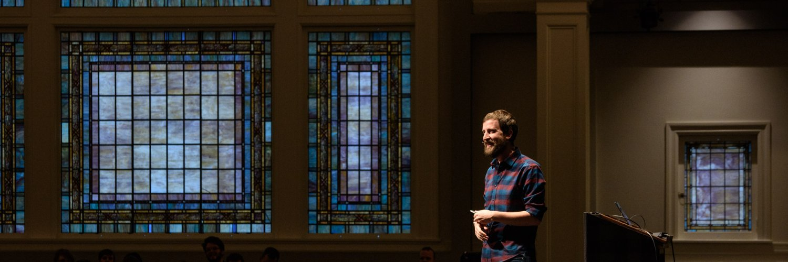

Welcome! Hello! This is the Complete Intro to Databases. I'm so excited to share with you some of my knowledge that I've earned working in the field. Knowing how to properly use a database will give you a leg up in your career, both from the perspective of being to achieve more in your apps and from the perspective of being able to interview well for jobs that need to use databases. And if I'm being honest, I think learning how to and using these databases is a lot of fun. It's a fantastic feeling to throw some data into one of these databases and then be able to retrieve data and insight using various querying techniques and abilities.

## Who is this course for?

This course is for anyone who wants to understand the various sorts of databases that are available to them, how to use a few of them, and when to choose which one.

In order to get the most out of this course, you should be comfortable with a command line prompt and a little bit of programming. If you are not familiar with a command line prompt, [I taught a course on it here][command-line] that if you take that will more than get you ready for this course. If you are not familiar with programming, [I have course on that too][web-dev].

All the programming samples will be in JavaScript with Node.js but if you code in something else like Python or Ruby these code samples should look familiar enough that you should be fine. The code won't be the focus of the samples, the database interactions will be.

## Who am I?

My name is Brian Holt and I am a principal program manager at Microsoft (as of writing.) I have been writing code most of my life thanks to my dad and brother and I have been a professional developer for a decade. Actually, funnily enough, my father used to work one of the OG large-scale databases, IBM DB2. It is a bit of a full circle for me to be coming in and teaching a course on databases considering that. Of course we're going to be focusing on open source databases!

I'm excited to share with you my experience using databases that I've garnered over my career at companies like Reddit, Netflix, LinkedIn, and Microsoft. I had to write a lot of SQL early in my career (from MySQL primarily) and it has only helped me throughout my career. I was also an early user of MongoDB and attended one of the first MongoDB Days in San Francisco. Believe it or not that was actually my first tech conference (I've since been to 150+ events.)

When I'm not working at Microsoft or working on Frontend Masters content I try to get away from my keyboard. I enjoy exercising (I'm on Peloton at [btholt][peloton] if you want exercise with me!), Islay Scotches, local beer, medium roast coffee, traveling around the world, playing with my adorable Havanese dog Luna, hanging out with my amazing wife [Niki][niki], and getting my ass kicked at Dota 2 and Overwatch. I'm passionate about people and helping them fulfill their own potentials, having amazing local experiences where ever I am, and having a drink with those I love.

Lastly, while I have your attention, just wanted to call some attention to my favorite charitable organizations. Spare a dollar for these fine people if you have one to give.

- [AnnieCannons][ac]
- [The Last Mile][tlm]
- [VetsWhoCode][vwc]
- [Legal Counsel for Youth and Children][lcyc]

## Special Thanks to Frontend Masters

I want to thank Marc and the whole Frontend Masters team explicitly. In addition to being family to me these are some of the most wonderful people I've ever met. You are reading or watching this course thanks to their hard work to make the world of tech more approachable with high quality instructors teaching what they know best. I want to thank them for creating the platform, garnering a community of knowledge-seeking developers, and giving me incentive and a platform to speak to you all. One specific kindness is that while the videos are on the platform (and I think they are worth every penny to watch) they let me release this website and materials as open source so every person can acquire the knowledge.

Thanks Frontend Masters. Y'all are the best.

## PS

Please catch up with me on social media! Do note I'm not the best at responding to private messages, especially Twitter DMs and LinkedIn messages!

- [Twitter][tw]
- [LinkedIn][li]
- [GitHub][gh]

[command-line]: https://frontendmasters.com/courses/linux-command-line/
[web-dev]: https://frontendmasters.com/courses/web-development-v2/
[peloton]: https://members.onepeloton.com/members/btholt/overview
[niki]: https://twitter.com/ImNikiHolt
[lcyc]: http://lcycwa.org/donate
[tw]: https://twitter.com/holtbt
[gh]: https://github.com/btholt
[li]: https://linkedin.com/in/btholt
[course]: https://github.com/btholt/complete-intro-to-linux-and-the-cli
[tlm]: https://thelastmile.org/donate/
[ac]: https://anniecannons.org/invest
[vwc]: https://vetswhocode.io/donate
